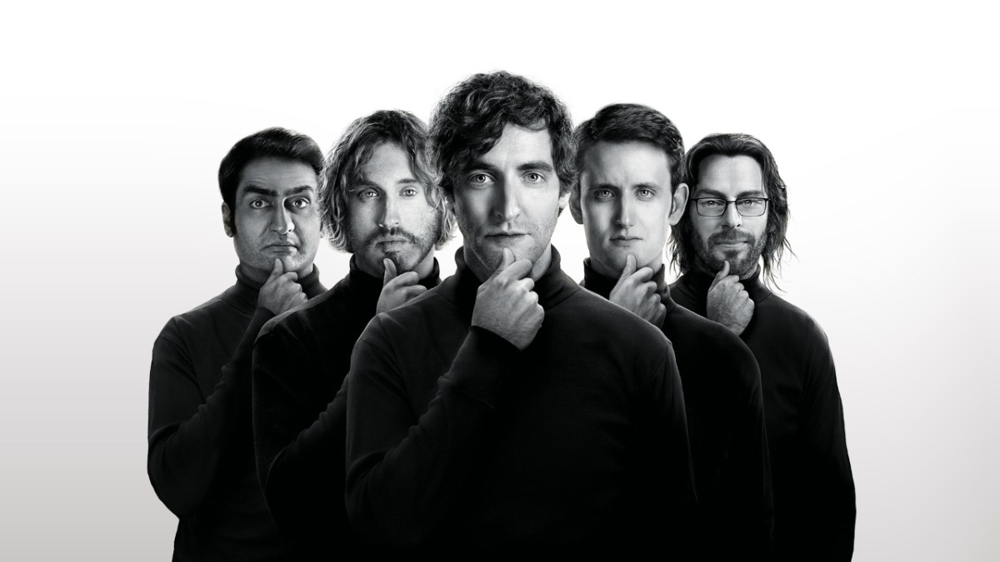

class:center, middle
```{r setup, include=FALSE}
options(htmltools.dir.version = FALSE)
```


```{r cast-img, echo = FALSE}

```


.center[HBO's [Silicon Valley](https://www.hbo.com/silicon-valley)]

---
class:center, middle

<iframe width="560" height="315" src="https://www.youtube.com/embed/ACmydtFDTGs" frameborder="0" allow="accelerometer; autoplay; encrypted-media; gyroscope; picture-in-picture" allowfullscreen></iframe>


---

```{r not-hotdog-img, echo = FALSE}

```


HBO built a real iOS and Android app they call [Not Hotdog](https://www.seefoodtechnologies.com/nothotdog/)

In depth description of the process is on [Medium](https://medium.com/@timanglade/how-hbos-silicon-valley-built-not-hotdog-with-mobile-tensorflow-keras-react-native-ef03260747f3)


???
I'm calling mine "Hotdog"

---

### Data Collection


It's surprisingly difficult to find a collection of hot dog images.

Luckily I ended up finding one on [Kaggle](https://www.kaggle.com/dansbecker/hot-dog-not-hot-dog/data) but it's not very large (~ 500 images).

It comes from the Food 101 data set so all not hot dog images are of food.


???

I spent a long time looking for data. The HBO app developers didn't release their data.
p
Someone else had luck with Image Net but it's under maintenance and only some images are available.


---

### Modeling

Developed with R Keras on a GPU-enabled Paperspace machine.

Tried a slew of architectures but accuracy wasn't better than a coin flip.

Then tried data augmentation but still wasn't getting good results.

Finally used a pre-trained network with data augmentation.

This gave a huge performance boost achieving 90% test set accuracy.


???
poor results probably b/c not very many images

data augmentation: things like rotating an image, zooming in/out, etc.

pre-trained: use frozen weights from trained model and train classifier on top


---

### The App

Built with [Shiny](https://www.rstudio.com/products/shiny/), an R package for making web applications.

Upload an image and find out if it's a hot dog or not hot dog.

Available at [https://asbates.shinyapps.io/hotdog/](https://asbates.shinyapps.io/hotdog/).


???

the interface is very simple but what goes on under the hood is complex and powerful 

the app might be a bit slow b/c i don't think the machine is very big


