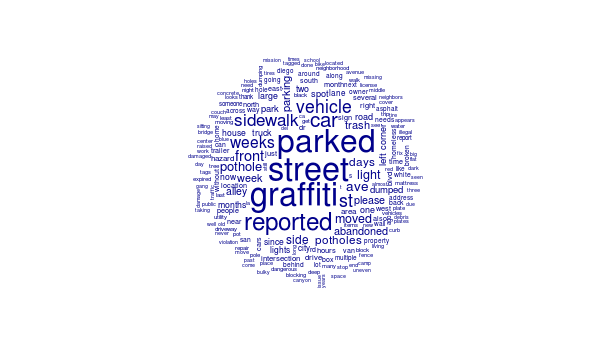

```{r setup, include=FALSE}
options(htmltools.dir.version = FALSE)
```


# San Diego 311 - Get It Done

```{r, echo = FALSE}

```

- City of San Diego's [Get It Done app](https://www.sandiego.gov/get-it-done) allows the public to
    - Apply for a business license, parking permit, ...
    - Pay for library fees, parking tickets, ...
    - Request a new traffic sign, street sweeping, ...
    - **Report a complaint: graffiti, potholes, ...**

We will be focusing on the last item

---
# The Data

Obtained from the [San Diego Open Data Portal](https://data.sandiego.gov)

Get It Done [requests from 2018](https://data.sandiego.gov/datasets/get-it-done-311/)

Narrowed to the top complaint types:

.pull-left[
- 72 hour parking violation
- Graffiti removal
- Potholes
]

.pull-right[
- Illegal dumping
- Sidewalk repair
- Street light out
]

???
about 70,000 observations after filtering

---

```{r, echo = FALSE}

```

???
top 200 words

that appear at least 5 times

graffiti and 72 hour parking violation should be easy

---
# Data Processing

- Done with the [quanteda](https://quanteda.io) package
- Removed stopwords, punctuation, symbols, Twitter characters (@, #)
- Removed words that only appeared in a single document
- Created a document-feature matrix:
    - Each row is a document
    - Each column is a word
    

???
"document" here means a description of the issue

reduced number of features (words) from 24k to 12k

---
# The Models

- Naive Bayes classifier as a baseline
- Two neural networks:
    - Single hidden layer (512 units)
    - Two hidden layers (256, 128 units, 50% dropout)


???
naive bayes via `quanteda`

neural nets via `keras` and `tensorflow`

---
# The Results


| Model | Test set accuracy
|:---|---:|
|Naive Bayes | 94.7% 
| Single layer NN | 95.7% 
| Two layer NN | 95.9% 


Naive Bayes did remarkably well

Neural networks didn't do much better

???
actually, neural nets overfit almost immediately

final training for single layer only used 2 & 4 epochs

---
# Takeaway

Neural networks can easily be overkill

Even on problems they are supposed to be good at (i.e. text)

Try something simple first

---

class: center, middle

# Thanks!

Slides created via the R package [**xaringan**](https://github.com/yihui/xaringan).

Code and slides available at [https://github.com/asbates/neural-nets/tree/master/sd311](https://github.com/asbates/neural-nets/tree/master/sd311)
